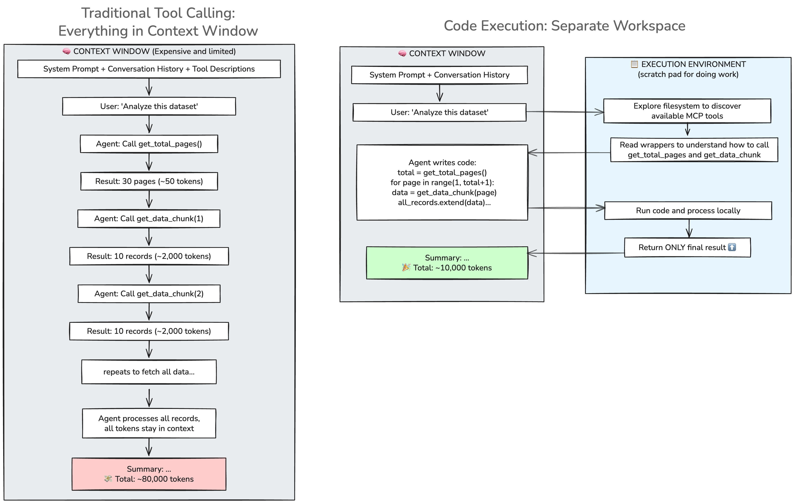

# Code execution with MCP

This repository demonstrates the key difference between traditional tool calling and code execution with the [Model Context Protocol (MCP)](https://modelcontextprotocol.io). It shows how separating context from execution environment can make AI agents more efficient and cost-effective for data-heavy tasks.

This demo is based on blog posts from [Anthropic](https://www.anthropic.com/engineering/code-execution-with-mcp) and [Cloudflare](https://blog.cloudflare.com/code-mode/) about code execution with MCP.

The examples here use a local MCP server to demonstrate the full MCP + code execution stack. The MCP server simulates latency and provides synthetic data. Run the demos below or read the [full writeup](WRITEUP.md) for more details about the concepts.

## Run the demos

This demo shows an example of traditional tool calling and an updated example using code execution with MCP.

The local MCP server ([mcp_servers/data_mcp_server.py](mcp_servers/data_mcp_server.py)) fetches paginated data about synthetic user activity and introduces artificial delays (100-200ms) to simulate latency in a real API.

### Prerequisites

- Python 3.10+
- Anthropic API key (get one at [console.anthropic.com](https://console.anthropic.com/))

### Installation

The following commands do the following:
- Clone the repository
- Install dependencies
- Copy `.env.example` to `.env`
    - **You must add your ANTHROPIC_API_KEY to the `.env` file**
- Generate MCP tool wrappers for the code execution MCP example

```bash
# Clone this repository
git clone https://github.com/sarahcstringer/mcp-code-demo
cd mcp-code-demo

# Create a virtual environment
python -m venv venv
source venv/bin/activate  # On Windows: venv\Scripts\activate

# Install dependencies
pip install -r requirements.txt

# Set up your API key
cp .env.example .env
# Edit .env and add your ANTHROPIC_API_KEY

# Generate MCP tool wrappers (required for Example 2)
python generate_wrappers.py
```

> The MCP tool wrappers are used for the code execution MCP example. 

### Examples

### Example 1: Traditional MCP tool calling

```bash
python examples/traditional_tool_calling.py
```

This example demonstrates traditional MCP tool calling where all tool results pass through the context window. The agent analyzes paginated API logs by fetching user activity data from an MCP server.

**The MCP server exposes:**
- `get_total_pages()` - Returns total number of pages (30)
- `get_data_chunk(page)` - Returns dict with 10 user activity records

**Each record contains:**
```json
{
  "id": 1,
  "user_id": "user_3",
  "activity": "login",
  "timestamp": "2024-01-01T00:00:00Z",
  "metadata": {
    "duration_seconds": 45,
    "success": true
  }
}
```

**The task:** Calculate total failed activities, identify the most active user, and compute average duration.

**What happens:**
- All MCP tool descriptions are loaded into the context window at the start.
- Agent calls `get_total_pages()` → gets `30`.
- Calls `get_data_chunk(1)`, `get_data_chunk(2)`, ..., for all 30 pages, each time adding 10 records to the context.
- All 300 records accumulate in the context window.
- Agent processes everything in context (counts failures, finds most active user, calculates average duration).
- Every tool call adds data to the context, using up a significant number of tokens for intermediate data.

### Example 2: Code execution with MCP

```bash
python examples/code_execution.py
```

> **Note**: you must generate the `mcp_tools/` directory first by running `python generate_wrappers.py`

This example does the same task as the previous example, but with code execution instead of traditional tool calling. It follows [Anthropic's pattern](https://www.anthropic.com/engineering/code-execution-with-mcp) for using code execution with MCP.

**What happens:**
- The agent uses a bash tool to access a code execution environment.
- Instead of getting MCP tools directly, the agent discovers them by exploring the file system (finding the `mcp_tools/` directory and reading its Python wrappers).
- The agent writes Python code for the task, calling the MCP tools directly in the execution environment.
- All 300 records stay in the execution environment and never enter the context window. Only the final summary is sent back.

## The core insight

**Traditional tool calling** loads all MCP tool descriptions, parameter schemas, return types, and usage instructions into the context window upfront. Then it sends all intermediate results through the LLM's context window as the agent orchestrates tool calls one by one.

**Code execution** allows dynamic discovery—the agent explores the file system to find available tools and reads their implementations. It runs processing in a separate execution environment and only sends final results back to context.

This can significantly reduce token usage for data-heavy tasks while enabling new capabilities like polling, waiting, and stateful processing.



**Implementation note:** Modern agent frameworks like [Claude Code](https://www.anthropic.com/engineering/code-execution-with-mcp) and [Cloudflare Agents](https://blog.cloudflare.com/code-mode/) provide code execution environments built-in. However, you can achieve the same pattern by giving an LLM a bash tool that executes commands - this is the approach used in these examples.

**Security consideration:** When giving an LLM the ability to execute code, implement appropriate guardrails such as sandboxing, human-in-the-loop verification for sensitive operations, code review before execution, and limiting filesystem/network access. Only run code in environments where you can verify and trust what's being executed.

## Project structure

```
mcp-code/
├── examples/                         # Runnable examples
│   ├── traditional_tool_calling.py  # Example 1: Traditional MCP tool calling
│   └── code_execution.py            # Example 2: Code execution + MCP (file system wrappers)
├── mcp_servers/                      # MCP server for demo
│   └── data_mcp_server.py           # MCP server: paginated data fetching tools
├── mcp_tools/                        # Auto-generated Python wrappers (run generate_wrappers.py)
│   ├── __init__.py                  # Package exports
│   ├── mcp_client.py                # Handles actual MCP communication
│   └── data_tools.py                # Wrappers for data_tools MCP server
├── generate_wrappers.py             # Script to generate mcp_tools/ from MCP servers
├── WRITEUP.md                       # Writeup of the demo and my thoughts on the concepts
├── README.md                        # This file
└── requirements.txt                 # Python dependencies
```

## Learn more

- [Read the full writeup](WRITEUP.md) - Detailed explanation of concepts
